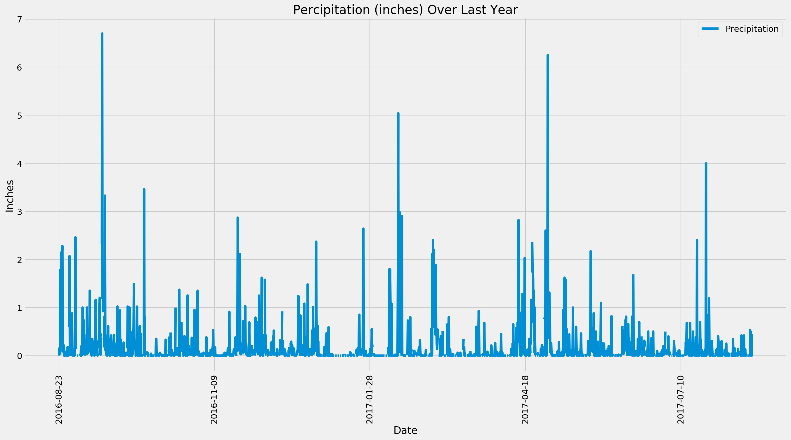
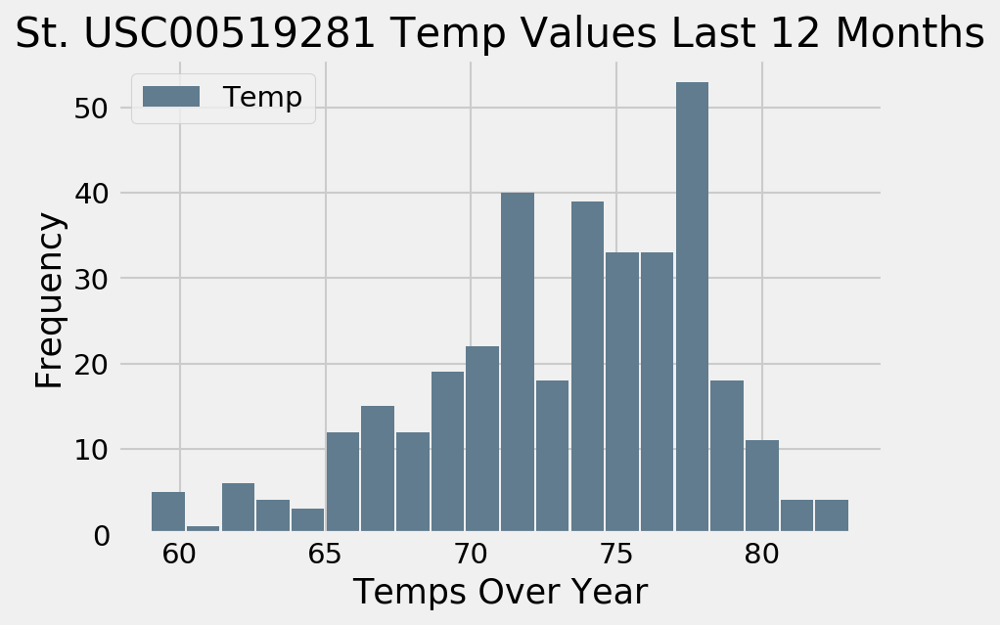
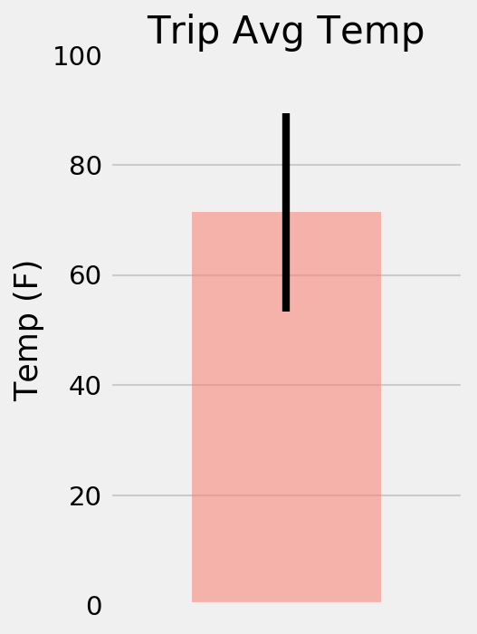

# sqlalchemy-challenge  
Surfs Up! I'm planning a long holiday surf vacation in Honolulu, Hawaii! To help with my trip planning, I need to do some climate analysis on the area. The supporting jupyter file includes my analysis code. 
 

## Using python and sqlalchemy to research average temps and rainfall in Honolulu. Searching for the ideal vacation dates.

